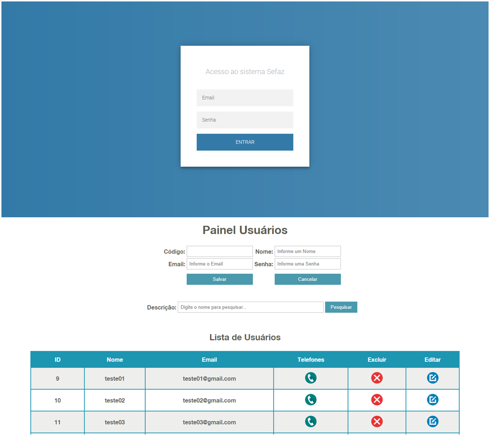

## :rocket: Desafio Sefaz

### :art: Layout

  

----------

### :hammer_and_wrench: Ferramentas
As seguintes tecnologias foram utilizadas na construção do projeto:
- Servlets e JavaServer Pages;
- JDBC;
- Banco de Dados Relacional - PostgreSQL 13;
- Apache Tomcat 9.0.40;
- Padrão MVC;
- Eclipse IDE 2020-09.
- Maven Dependencies:
	- junit-4.11.jar
	- postgresql-42.2.20.jar
	- jstl-1.2.jar

----------

###  :computer: Servidor de Desenvolvimento

Deploy no Heroku:
- https://java-desafio-sefaz.herokuapp.com/

Para clonar o repositório do git:
1. git remote add origin https://github.com/josegustavo312/maven-desafio-sefaz.git
2. git branch -M main
3. git push -u origin main

Configuração do banco:
- Servidor local: connection/SingleConnection.java
- Servidor web: connection/SingleConnectionLocal.java

Executando localmente na IDE Eclipse com o Apache Tomcat 9:
1. Run As / Run on Server;
2. Tomcat v9.0 Server at localhost;
3. Add o projeto;
4. Finish.

Credenciais do administrador para o primeiro acesso:
- Email: admin@gmail.com
- Senha: admin

----------

###  :gear: Função
- [x] CRUD de Usuários;

----------

###  :eyeglasses: Autor
José Gustavo da Silva.
 

